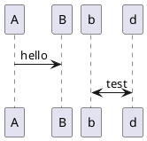
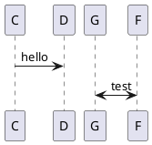

# Python Code





```python
# -*- coding: utf-8 -*-
import sys
import urllib.request as request
from bs4 import BeautifulSoup

def getHTML(url):
    headers = {'User-Agent': 'User-Agent:Mozilla/5.0 (Macintosh; Intel Mac OS X 10_12_3) AppleWebKit/537.36 (KHTML, like Gecko) Chrome/56.0.2924.87 Safari/537.36'}
    req = request.Request(url, headers=headers)
    return request.urlopen(req).read()

def get_pengfu_results(url):
    soup = BeautifulSoup(getHTML(url), 'lxml')
    return soup.find_all('div', {'class':"content-img clearfix pt10 relative"})

def get_pengfu_joke():
    for x in range(1, 2):
        url = 'http://www.pengfu.com/xiaohua_%d.html' % x
        for x in get_pengfu_results(url):
            content = x.string
            try:
                string = content.lstrip()
                print(string + '\n\n')
            except:
                continue
    return

def get_qiubai_results(url):
    soup = BeautifulSoup(getHTML(url), 'lxml')
    contents = soup.find_all('div', {'class':'content'})
    restlus = []
    for x in contents:
        str = x.find('span').getText('\n','<br/>')
        restlus.append(str)
    return restlus

def get_qiubai_joke():
    for x in range(1, 2):
        url = 'http://www.qiushibaike.com/8hr/page/%d/?s=4952526' % x
        for x in get_qiubai_results(url):
            print(x + '\n\n')
    return

if __name__ == '__main__':
    get_pengfu_joke()
    get_qiubai_joke()
```